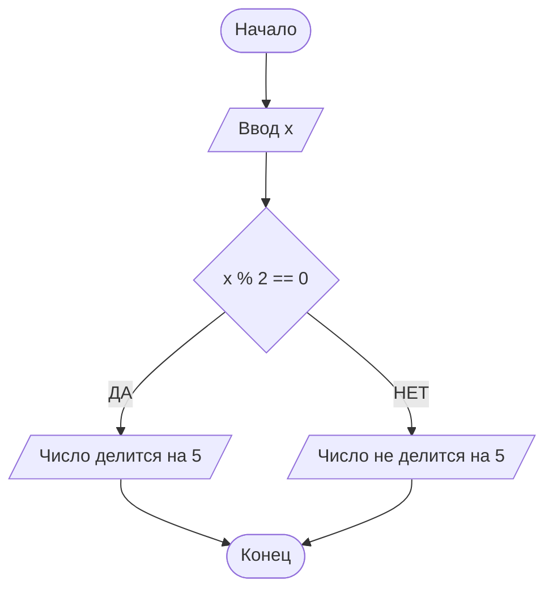

Министерство науки и высшего образование Российской Федерации
Уфимский университет науки и технологий

Кафедра АСУ

ОТЧЕТ
по лабораторной работе № 3
По теме: ДИАГРАММА КАК КОД

По дисциплине «Основы современных цифровых технологий и искусственного интеллекта»

Выполнил: студент гр. ИВТ-ИСУ-103Б Сырчин Илья Евгеньевич

Проверил: профессор каф. АСУ
Арьков В.Ю.

Уфа  2025

### Цель работы: познакомиться с рисованием схем и даиграмм и изучить сопутствующие материалы.

# Ход работы: 

**Посмотрел ГОСТ рисования блок схем:**


**Связь WorkFlow Diagram и Flowchart**
| Критерий | Workflow Diagram (Диаграмма рабочего процесса) | Flowchart (Схема алгоритма) |
| :--- | :--- | :--- |
| **Основной фокус** | **Бизнес-процесс** (что, кем и в каком порядке делается в компании). | **Алгоритм** (логика решения конкретной задачи, часто вычислительной). |
| **Уровень абстракции** | Более высокий, включает роли, артефакты (документы), системы. | Более низкий, фокусируется на конкретных операциях и проверках условий. |
| **Исполнитель** | Люди, отделы, ИТ-системы (**роли**). | Компьютер, программа, устройство или абстрактный исполнитель алгоритма. |
| **Язык / Стандарт** | Чаще всего **BPMN 2.0** (богатый набор элементов для бизнес-взаимодействий). | Классический стандарт блок-схем (ISO 5807, ГОСТ 19.701-90). |
| **Основная цель** | Оптимизация, стандартизация, автоматизация и документирование **бизнес-процесса**. | Проектирование, понимание и документирование **логики программы/алгоритма**. |
| **Типичные элементы** | Задачи, пулы/дорожки (для ролей), события (таймер, сообщение), шлюзы, артефакты (данные, документы). | Старт/стоп (овал), процесс (прямоугольник), решение (ромб), ввод/вывод (параллелограмм), стрелки потока. |
| **Контекст применения** | Бизнес-анализ, управление процессами (BPM), организационное проектирование. | Программирование, инженерия, математика, объяснение алгоритмов. |


## Диаграмма с drawio

Чтобы вставить диагрмму в файл .MD нужно сохрнаить его формте .svg


<?xml version="1.0" encoding="UTF-8"?>
<!-- Do not edit this file with editors other than draw.io -->
<!DOCTYPE svg PUBLIC "-//W3C//DTD SVG 1.1//EN" "http://www.w3.org/Graphics/SVG/1.1/DTD/svg11.dtd">
<svg xmlns="http://www.w3.org/2000/svg" style="background: transparent; background-color: transparent; color-scheme: light dark;" xmlns:xlink="http://www.w3.org/1999/xlink" version="1.1" width="122px" height="252px" viewBox="0 0 122 252" content="&lt;mxfile host=&quot;app.diagrams.net&quot; agent=&quot;Mozilla/5.0 (Windows NT 10.0; Win64; x64) AppleWebKit/537.36 (KHTML, like Gecko) Chrome/140.0.0.0 YaBrowser/25.10.0.0 Safari/537.36&quot; version=&quot;29.2.2&quot;&gt;&#10;  &lt;diagram name=&quot;Page-1&quot; id=&quot;ctpdQca3ycjqCeiAbs8v&quot;&gt;&#10;    &lt;mxGraphModel dx=&quot;1158&quot; dy=&quot;711&quot; grid=&quot;1&quot; gridSize=&quot;10&quot; guides=&quot;1&quot; tooltips=&quot;1&quot; connect=&quot;1&quot; arrows=&quot;1&quot; fold=&quot;1&quot; page=&quot;1&quot; pageScale=&quot;1&quot; pageWidth=&quot;827&quot; pageHeight=&quot;1169&quot; math=&quot;0&quot; shadow=&quot;0&quot;&gt;&#10;      &lt;root&gt;&#10;        &lt;mxCell id=&quot;0&quot; /&gt;&#10;        &lt;mxCell id=&quot;1&quot; parent=&quot;0&quot; /&gt;&#10;        &lt;mxCell id=&quot;BhV8mAuxKjwOXms5wpue-1&quot; edge=&quot;1&quot; parent=&quot;1&quot; source=&quot;BhV8mAuxKjwOXms5wpue-2&quot; style=&quot;edgeStyle=orthogonalEdgeStyle;rounded=0;orthogonalLoop=1;jettySize=auto;html=1;&quot; target=&quot;BhV8mAuxKjwOXms5wpue-4&quot; value=&quot;&quot;&gt;&#10;          &lt;mxGeometry relative=&quot;1&quot; as=&quot;geometry&quot; /&gt;&#10;        &lt;/mxCell&gt;&#10;        &lt;mxCell id=&quot;BhV8mAuxKjwOXms5wpue-2&quot; parent=&quot;1&quot; style=&quot;strokeWidth=2;html=1;shape=mxgraph.flowchart.terminator;whiteSpace=wrap;&quot; value=&quot;НАЧАЛО&quot; vertex=&quot;1&quot;&gt;&#10;          &lt;mxGeometry height=&quot;60&quot; width=&quot;120&quot; x=&quot;270&quot; y=&quot;130&quot; as=&quot;geometry&quot; /&gt;&#10;        &lt;/mxCell&gt;&#10;        &lt;mxCell id=&quot;BhV8mAuxKjwOXms5wpue-3&quot; edge=&quot;1&quot; parent=&quot;1&quot; source=&quot;BhV8mAuxKjwOXms5wpue-4&quot; style=&quot;edgeStyle=orthogonalEdgeStyle;rounded=0;orthogonalLoop=1;jettySize=auto;html=1;&quot; target=&quot;BhV8mAuxKjwOXms5wpue-5&quot; value=&quot;&quot;&gt;&#10;          &lt;mxGeometry relative=&quot;1&quot; as=&quot;geometry&quot; /&gt;&#10;        &lt;/mxCell&gt;&#10;        &lt;mxCell id=&quot;BhV8mAuxKjwOXms5wpue-4&quot; parent=&quot;1&quot; style=&quot;rounded=0;whiteSpace=wrap;html=1;&quot; value=&quot;Середина&quot; vertex=&quot;1&quot;&gt;&#10;          &lt;mxGeometry height=&quot;60&quot; width=&quot;120&quot; x=&quot;270&quot; y=&quot;230&quot; as=&quot;geometry&quot; /&gt;&#10;        &lt;/mxCell&gt;&#10;        &lt;mxCell id=&quot;BhV8mAuxKjwOXms5wpue-5&quot; parent=&quot;1&quot; style=&quot;strokeWidth=2;html=1;shape=mxgraph.flowchart.terminator;whiteSpace=wrap;&quot; value=&quot;КОНЕЦ&quot; vertex=&quot;1&quot;&gt;&#10;          &lt;mxGeometry height=&quot;60&quot; width=&quot;120&quot; x=&quot;270&quot; y=&quot;320&quot; as=&quot;geometry&quot; /&gt;&#10;        &lt;/mxCell&gt;&#10;      &lt;/root&gt;&#10;    &lt;/mxGraphModel&gt;&#10;  &lt;/diagram&gt;&#10;&lt;/mxfile&gt;&#10;"><defs/><g><g data-cell-id="0"><g data-cell-id="1"><g data-cell-id="BhV8mAuxKjwOXms5wpue-1"><g transform="translate(0.5,0.5)"><path d="M 61 61 L 61 94.63" fill="none" stroke="#000000" stroke-miterlimit="10" pointer-events="stroke" style="stroke: light-dark(rgb(0, 0, 0), rgb(255, 255, 255));"/><path d="M 61 99.88 L 57.5 92.88 L 61 94.63 L 64.5 92.88 Z" fill="#000000" stroke="#000000" stroke-miterlimit="10" pointer-events="all" style="fill: light-dark(rgb(0, 0, 0), rgb(255, 255, 255)); stroke: light-dark(rgb(0, 0, 0), rgb(255, 255, 255));"/></g></g><g data-cell-id="BhV8mAuxKjwOXms5wpue-2"><g><path d="M 37.73 1 L 84.27 1 C 104.55 1 121 14.43 121 31 C 121 47.57 104.55 61 84.27 61 L 37.73 61 C 17.45 61 1 47.57 1 31 C 1 14.43 17.45 1 37.73 1 Z" fill="#ffffff" stroke="#000000" stroke-width="2" stroke-miterlimit="10" pointer-events="all" style="fill: light-dark(#ffffff, var(--ge-dark-color, #121212)); stroke: light-dark(rgb(0, 0, 0), rgb(255, 255, 255));"/></g><g><g><switch><foreignObject style="overflow: visible; text-align: left;" pointer-events="none" width="100%" height="100%" requiredFeatures="http://www.w3.org/TR/SVG11/feature#Extensibility"><div xmlns="http://www.w3.org/1999/xhtml" style="display: flex; align-items: unsafe center; justify-content: unsafe center; width: 118px; height: 1px; padding-top: 31px; margin-left: 2px;"><div style="box-sizing: border-box; font-size: 0; text-align: center; color: #000000; "><div style="display: inline-block; font-size: 12px; font-family: Helvetica; color: light-dark(#000000, #ffffff); line-height: 1.2; pointer-events: all; white-space: normal; word-wrap: normal; "><path d="M 61 189.88 L 57.5 182.88 L 61 184.63 L 64.5 182.88 Z" fill="#000000" stroke="#000000" stroke-miterlimit="10" pointer-events="all" style="fill: light-dark(rgb(0, 0, 0), rgb(255, 255, 255)); stroke: light-dark(rgb(0, 0, 0), rgb(255, 255, 255));"/></g></g><g data-cell-id="BhV8mAuxKjwOXms5wpue-4"><g transform="translate(0.5,0.5)"><rect x="1" y="101" width="120" height="60" fill="#ffffff" stroke="#000000" pointer-events="all" style="fill: light-dark(#ffffff, var(--ge-dark-color, #121212)); stroke: light-dark(rgb(0, 0, 0), rgb(255, 255, 255));"/></g><g><g><switch><foreignObject style="overflow: visible; text-align: left;" pointer-events="none" width="100%" height="100%" requiredFeatures="http://www.w3.org/TR/SVG11/feature#Extensibility"><div xmlns="http://www.w3.org/1999/xhtml" style="display: flex; align-items: unsafe center; justify-content: unsafe center; width: 118px; height: 1px; padding-top: 131px; margin-left: 2px;"><div style="box-sizing: border-box; font-size: 0; text-align: center; color: #000000; "><div style="display: inline-block; font-size: 12px; font-family: Helvetica; color: light-dark(#000000, #ffffff); line-height: 1.2; pointer-events: all; white-space: normal; word-wrap: normal; ">

## Диаграмма mermaid
После сохранения диагарммы в разных форматах сразу заметно, что качество .svg файла значительно выше, чем аналогичного файла в .png.
Скопировав изображение и вставив его в файл .md оно отображается корректно без нужды скачиавания файла..
Но еще легче просто втавить код тогда изображение можно будет двигать и настроить под себя.

***КОД:***
```
flowchart TD
   A([Начало]) -->
   B[/Ввод x/] -->
   C{x % 5 == 0} --> |ДА| D[/Число делится на 5/] --> Z([Конец])
C --> |НЕТ| E[/Число не делится на 5/] --> Z
```
***Результат:***

### Docker + mermaid 
Найдем нужный нам контейнер с именем mermaid-live-editor, установим и запустим его:


Перейдя по ссылке mermaid откроется на локальном порте. Вставим туда наш предыдущий код лдя проверки и получим тот же результат.


**Познакомившись с данным способом создания блок схем неплохо бы узнать почему создатели решили выбрать такое необычное название для своего проекта**
Зададим вопрос одному из чат ботов, который наиболее хорошо показал себя в работе с предыдущими лабораторными работами - Deep Seek

И получим такой ответ:
```
Происхождение названия Mermaid
Название инструмента для создания диаграмм Mermaid имеет интересное и вполне личное происхождение, связанное с его создателем Knut Sveidqvist.

История возникновения названия началась в 2014 году, когда Sveidqvist потерял файл Microsoft Visio, над которым работал. Раздосадованный необходимостью переделывать всю работу заново, он начал размышлять о более удобном способе создания диаграмм. На обратном пути домой он решил, что диаграммы было бы логичнее хранить в текстовом формате, подобно Markdown, который в то время начинал набирать популярность.​

Вернувшись домой, Sveidqvist решил немедленно начать разработку этого проекта. В тот же вечер, когда он сел писать код в гостиной, его дети смотрели мультфильм "Русалочка" (The Little Mermaid) по телевизору. Название настолько запомнилось ему и казалось таким уместным для проекта, что он назвал инструмент Mermaid (Русалочка) — просто потому, что это слово "застряло в его голове".​

Символический смысл выбора этого названия можно интерпретировать нескольким образом. Русалочка — это мифическое существо, которое живёт на границе двух миров (суши и моря), что метафорически отражает природу инструмента, объединяющего текст и визуальные диаграммы. Также название звучит легко, запоминается и привлекает внимание, что оказалось удачной маркетинговой стратегией для проекта с открытым исходным кодом.

Этот выбор названия оказался успешным — к 2023 году Mermaid накопил более 8 миллионов пользователей и примерно 65 000 звёзд на GitHub. Интересно отметить, что позже компания Mermaid Chart была основана на базе этого проекта с поддержкой Microsoft и венчурного капитала, хотя изначально инструмент был создан просто из личной необходимости и вдохновения мультфильмом
```

## Mind map
Прочитав статью в википедии про Mind map понятно, что она облегчает  восприятие информации и ее запоминание.
Notepad++, с которым мы работали раньше имеет расширение для работы с plantUML.

### Дерево профессий
Для выбора специальности обратимся к чат-боту написав такой промт:


После консультации остановился на выборе - Аналитик данных.
Попросим того же чат бота написать что делает наш специалист и создадим на основе его ответа RoadMap и используем цвета, чтобы сделать нашу карту нагляднее. Данные можно посмотреть в файле *RoadMap1.md*
Теперь попросим нашего бота написать полный код. Данные с файле *RoadMapAI.md*
Полную карту профессии можно посмотреть в файле *Full-mindmap.md*


## Обобщение из файлов
Напишем нашему чат боту такой промт, возьмем файл с профессией **Администратор баз данных**


| **Трудовая функция**       | **Дисциплины**                           |
| -------------------------- | ---------------------------------------- |
| Проектирование БД          | Теория баз данных, Моделирование данных  |
| Развертывание СУБД         | Администрирование Linux, SQL Server      |
| Мониторинг БД              | Performance Tuning, Скрипты Shell/Python |
| Резервное копирование      | Backup стратегии, Восстановление данных  |
| Оптимизация запросов       | Индексация, Query Optimization           |
| Безопасность БД            | Управление доступом, Шифрование данных   |
| Восстановление после сбоев | Disaster Recovery, High Availability     |
| Масштабирование систем     | Кластеризация, Cloud Databases           |


## Docker и PlantUML
Запустим контейнер, предварительно скачав и установив его

Возьмем нашу первую диаграмму и вставим код на нашем локальном порте:


# Вывод 
В этой работе я познакомился с одной из популярных нынче технологий работы с диаграммами под названием Diagram as code — «диаграмма как код». 
Можно сказать, что это развитие технологии облегчённой, упрощённой разметки текста Markdown.
Оба инструмента — и Mermaid, и PlantUML поддерживаются и интегрируются самыми разными платформами разработки и документирования.
Попутно мы увидели самые разные подходы и инструменты для запуска программ, в том числе переносимые приложения Portable Applications и контейнеры Docker.
Кроме того, мы на своём опыте почувствовали необходимость организации хранения разных версий нашей диаграммы.


